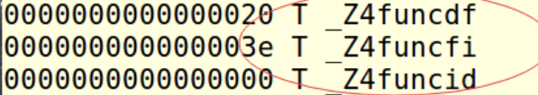
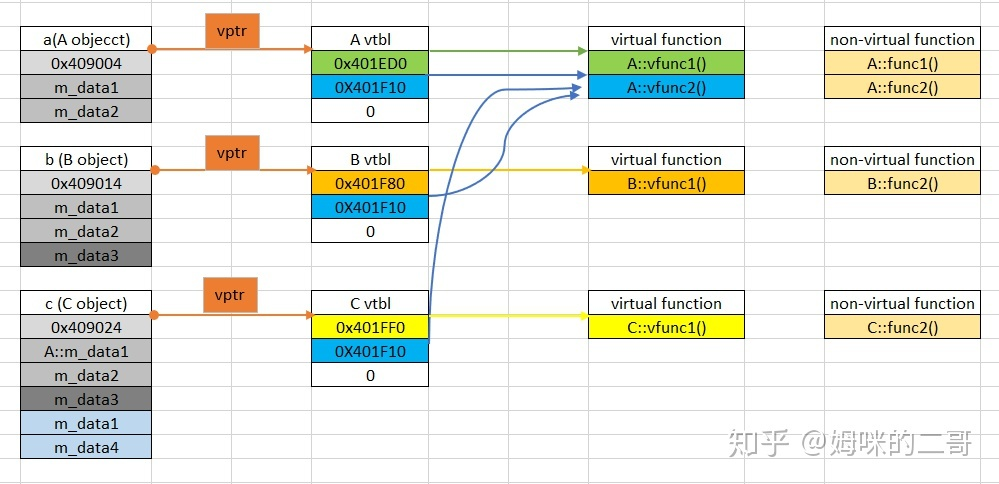
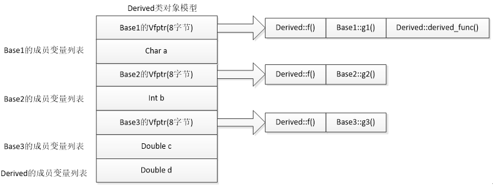
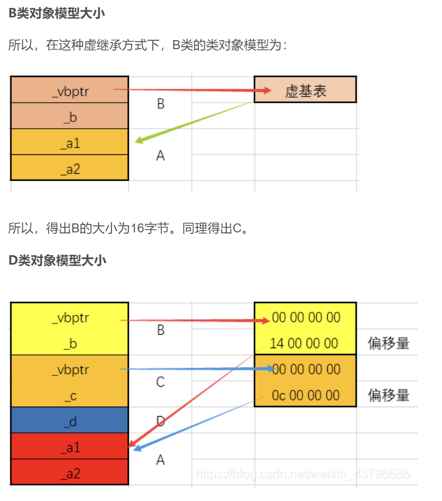
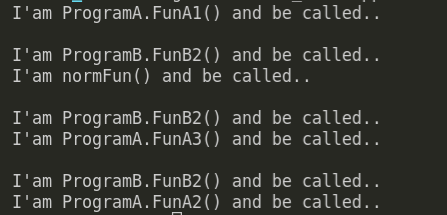
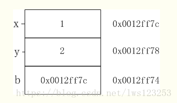

# 1、什么是多态机制？

多态就是说同一个名字的函数可以有多种不同的功能，分为编译时的多态和运行时的多态。

**编译时的多态**就是函数重载，包括运算符重载，编译时根据实参确定调用哪个函数。

**运行时的多态**则和虚函数、继承有关


# 2、多态的底层实现

**函数重载**： C++利用命名倾轧（name mangling）技术，来改名函数名，区分参数不同的同名函数。命名倾轧是在编译阶段完成的。




**虚函数**：[C++中的虚指针与虚函数表 - 知乎 (zhihu.com)](https://zhuanlan.zhihu.com/p/98776075)

```C++
class A {
public:
    virtual void vfunc1();
    virtual void vfunc2();
            void func1();
            void func2();
private:
    int m_data1, m_data1;
};

class B : public A {
public:
    virtual void vfunc1();
            void func2();
private:
    int m_data3;
};

class C : public B {
public:
    virtual void vfunc1();
            void func2();
private:
    int m_data1, m_data4;
};
```



# 3、虚函数的有关问题

## （1）父类构造函数中是否可以调用虚函数？

**可以。不过调用会屏蔽多态机制，最终会把基类中的该虚函数作为普通函数调用，而不会调用派生类中的被重写的函数。**


这是因为在定义子类对象的时候，会先调用父类的构造函数，**而此时虚函数表以及子类函数还没有被初始化，为了避免调用到未初始化的内存**，C++标准规范中规定了在这种情况下，**即在构造子类时调用父类的构造函数，而父类的构造函数中又调用了虚成员函数，这个虚成员函数即使被子类重写，也不允许发生多态的行为。**所以使用的是静态绑定，调用了父类的函数。

## （2）**构造函数可以是虚函数吗？**

不可以，因为**虚函数存在的唯一目的就是为了多态。**而子类并不继承父类的构造函数，构造函数是创建对象时自己主动调用的，不可能被继承，所以没有使父类构造函数变成虚函数的必要。另外，**父类在构造函数中创建虚函数表指针，实例化类对象**，如果构造函数成为虚函数，那么因为类对象没有实例化导致不可能后续出现虚函数。


首先，虚函数的唯一存在的原因就是为了构成多态，但是**派生类并不继承构造函数**，**构造函数是在创建对象时自己主动调用的，不可能通过子类的指针或者引用去调用继承。所以没必要（主要原因**）。另一方面，构造函数为类对象初始化了内存空间，里面保存指向虚函数的指针vfptr，如果构造函数是虚函数，导致没有实例化类对象，也就没有内存空间，也就不可能有虚函数。


## （3） **静态函数可以是虚函数么？**

- static成员**不属于任何类对象或类实例**，所以即使给此函数加上virutal也是没有任何意义的。-
- 静态与非静态成员函数之间有一个主要的区别。那就是静态成员函数**没有this指针**。所以无法访问vptr. 进而不能访问虚函数表。


## （4）**虚函数的安全性有什么问题？**[C++ 虚函数表解析 | 酷 壳 - CoolShell](https://link.zhihu.com/?target=https%3A//coolshell.cn/articles/12165.html%23%E5%AE%89%E5%85%A8%E6%80%A7)

- 可以通过虚函数表，让父类指针访问子类的自有函数
- 即使父类的虚函数是私有函数或者保护函数，仍然可以通过虚函数表访问，带来一定的安全问题。


## （5）析构函数可以是虚函数吗？

​     **析构函数最好是虚函数。**

    - 若析构函数是非虚的，即使基类指针指向的是子类对象，则delete 指针对象时，也仅调用基类的析构函数；

- **当基类的析构函数为虚函数时**，基类指针指向的是子类对象时，使用delete运算符删除指针对象，**析构函能够按照“先子类，后基类”的原则完成对象清理**；这样在多重继承的类中，能够保证每个类都能够得到正确的清理；比如基类和子类的缓冲区都能被释放；
- **析构函数可以是纯虚的**  = 0，但纯虚析构函数必须有定义体，否则编译失败

   **总结**：最好把基类的析构函数声明为虚函数。这将使所有派生类的析构函数自动成为虚函数。这样，如果程序中显式地用了delete运算符准备删除一个对象，而delete运算符的操作对象用了指向派生类对象的基类指针，则系统会调用相应类的析构函数。

专业人员一般都习惯声明虚析构函数，即使基类并不需要析构函数，也显式地定义一个函数体为空的虚析构函数，以保证在撤销动态分配空间时能得到正确的处理。

## （6）析构函数可以是纯虚的，但纯虚析构函数必须有定义体，否则编译失败

​	我觉得不一定。析构函数是虚函数的主要原因是，如果不是虚函数，每次结束时因为是父类指针所以只会调用父类的析构函数，而不会调用子类的析构函数，如果子类中有指针开辟空间，子类没有调用析构函数释放这个空间，就会导致内存泄露。但是如果子类中没有用指针开辟空间，都是普通的变量，应该就不会出现内存泄漏


## （7）虚函数和虚函数表的内存布局

首先整理一下虚函数表的特征：

- 虚函数表是全局共享的元素，即全局仅有一个，在编译时就构造完成

- 虚函数表类似一个数组，类对象中存储vptr指针，指向虚函数表，**即虚函数表不是函数，不是程序代码，不可能存储在代码段**

- 虚函数表存储虚函数的地址,即虚函数表的元素是指向类成员函数的指针,而类中虚函数的个数在编译时期可以确定，即虚函数表的大小可以确定,即大小是在编译时期确定的，不必动态分配内存空间存储虚函数表，所以不在堆中

 **C++中虚函数表位于只读数据段（.rodata），也就是C++内存模型中的常量区；**

**而虚函数则位于代码段（.text），也就是C++内存模型中的代码区。**


## （8）虚函数的默认参数问题，以及为什么会这样，默认参数具体存在哪个C++分区等？（雷火一、三面）

虚函数是动态绑定的，但是为了执行效率，缺省参数是静态绑定的。

执行的函数是动态查找的，但参数是A * a=new B()中A中的参数。、

```
Func(10) ;

会被编译器翻译成：

push 10                 //通常会先压参数

puch 返回地址

call func
```

默认参数在栈区

## （9）虚表指针和虚函数表产生的时机？

- 虚函数表是编译期间确实
- 虚表指针是程序运行时确实，执行对象构造函数时生成。
  


# 4、C++内存管理有关

## （1）类的大小问题

————————————————————————————————————————————————————————————

- 非静态成员的数据类型大小之和。

- 编译器加入的额外成员变量（如指向虚函数表的指针）。

- 为了边缘对齐优化加入的padding。

​    空类(无非静态数据成员)的对象的size为1, 当作为基类时, size为0. 

————————————————————————————————————————————————————————————

1. **空类** ：1个字节（因为还是存在实例的）
2. **一般类**：注意内存对齐即可 （无继承关系等.）
3. **含有虚函数的单一继承**: Base=(4+4)=8   Derived=(4+4+4)  Derived1=(4+4+8)

```c++
class Base
{
private:
    char a;
public:
    virtual void f();
    virtual void g();
};
class Derived:public Base
{
private:
    int b;
public:
    void f();
};
class Derived1:public Base
{
private:
    double b;
public:
    void g();
    virtual void h();
};
```

4. **含有虚函数的多继承**

```C++
class Base1
{
private:
    char a;
public:
    virtual void f();
    virtual void g1();
};
class Base2
{
private:
    int b;
public:
    virtual void f();
    virtual void g2();
};
class Base3
{
private:
    double c;
public:
    virtual void f();
    virtual void g3();
};
class Derived:public Base1, public Base2, public Base3
{
private:
    double d;
public:
    void f();
    virtual void derived_func();
}
```



- 这里画错了指针是4字节，sizeof(Derived)=40   (4+4) +（4+4）+（8+8）+8
- 有几个继承有几个虚函数指针，有几个虚函数表
- Derived类自己的虚函数表指针与其声明继承顺序的第一个基类Base1的虚函数表指针合并

5. **菱形继承：虚拟继承 virtual public**

```C++
#include<iostream>
using namespace std;
class A //基类
{
protected:
	int _a1 = 1;
	int _a2 = 10;
};

class B : virtual public A //B继承A
{
protected:
	int _b = 2;
};

class C : virtual public  A //C继承A
{
protected:
	int _c = 3;
};

class D : public B, public C //D继承B、C
{
protected:
	int _d = 4;
};

int main()
{
	cout << sizeof(A) << endl; //8
	cout << sizeof(B) << endl; //16
	cout << sizeof(C) << endl; //16
	cout << sizeof(D) << endl; //28
}
```



## （2）简要说明C++的内存分区

C++中的内存分区，分别是堆、栈、自由存储区、全局/静态存储区、常量存储区和代码区。如下图所示


**栈**：在执行函数时，函数内局部变量的存储单元都可以在栈上创建，函数执行结束时这些存储单元自动被释放。栈内存分配运算内置于处理器的指令集中，效率很高，但是分配的内存容量有限

**堆**：就是那些由 `new`分配的内存块，他们的释放编译器不去管，由我们的应用程序去控制，一般一个`new`就要对应一个 `delete`。如果程序员没有释放掉，那么在程序结束后，操作系统会自动回收

**自由存储区**：如果说堆是操作系统维护的一块内存，那么自由存储区就是C++中通过new和delete动态分配和释放对象的抽象概念。需要注意的是，自由存储区和堆比较像，但不等价。

**全局/静态存储区**：全局变量和静态变量被分配到同一块内存中，在以前的C语言中，全局变量和静态变量又分为初始化的和未初始化的，在C++里面没有这个区分了，它们共同占用同一块内存区，在该区定义的变量若没有初始化，则会被自动初始化，例如int型变量自动初始为0

**常量存储区**：这是一块比较特殊的存储区，这里面存放的是常量，不允许修改

**代码区**：存放函数体的二进制代码

## （3）什么是内存池，如何实现

[内存池介绍与经典内存池的实现 - 云+社区 - 腾讯云 (tencent.com)](https://cloud.tencent.com/developer/article/1177145)

内存池（Memory Pool） 是一种**内存分配**方式。通常我们习惯直接使用new、malloc 等申请内存，这样做的缺点在于：由于所申请内存块的大小不定，当频繁使用时会造成大量的内存碎片并进而降低性能。内存池则是在真正使用内存之前，先申请分配一定数量的、大小相等(一般情况下)的内存块留作备用。当有新的内存需求时，就从内存池中分出一部分内存块， 若内存块不够再继续申请新的内存。这样做的一个显著优点是尽量避免了内存碎片，使得内存分配效率得到提升。

这里**简单描述一下《STL源码剖析》中的内存池实现机制**：

**allocate 包装 malloc，deallocate包装free**

一般是一次20*2个的申请，先用一半，留着一半，为什么也没个说法，侯捷在STL那边书里说好像是C++委员会成员认为20是个比较好的数字，既不大也不小。

1. 首先客户端会调用malloc()配置一定数量的区块（固定大小的内存块，通常为8的倍数），假设40个32bytes的区块，其中20个区块（一半）给程序实际使用，1个区块交出，另外19个处于维护状态。剩余20个（一半）留给内存池，此时一共有（20*32byte）
2. 客户端之后有有内存需求，想申请（20\*64bytes）的空间，这时内存池只有（20\*32bytes），就先将（10\*64bytes)个区块返回，1个区块交出，另外9个处于维护状态，此时内存池空空如也.
3. 接下来如果客户端还有内存需求，就必须再调用malloc()配置空间，此时新申请的区块数量会增加一个随着配置次数越来越大的附加量，同样一半提供程序使用，另一半留给内存池。申请内存的时候用永远是先看内存池有无剩余，有的话就用上，然后挂在0-15号某一条链表上，要不然就重新申请。
4. 如果整个堆的空间都不够了，就会在原先已经分配区块中寻找能满足当前需求的区块数量，能满足就返回，不能满足就向客户端报**bad_alloc**异常

allocator就是用来分配内存的，最重要的两个函数是allocate和deallocate，就是用来申请内存和回收内存的，外部（一般指容器）调用的时候只需要知道这些就够了。

内部实现，目前的所有编译器都是直接调用的::operator new()和::operator delete()，说白了就是和直接使用new运算符的效果是一样的，所以老师说它们都没做任何特殊处理。 


**其实最开始GC2.9之前**

new和 operator new 的区别：new 是个运算符，编辑器会调用 operator new(0)

operator new()里面有调用malloc的操作，那同样的 operator delete()里面有调用的free的操作


**GC2.9下的alloc函数的一个比较好的分配器的实现规则如下：**

维护一条0-15号的一共16条链表，其中 0 号表示8 bytes ，1 号表示 16 bytes，2 号表示 24 bytes。。。。而15 号表示 16* 8 = 128 bytes。

如果在申请内存时，申请内存的大小并不是8的倍数（比如2、4、7、9、18这样不是8的倍数），那就找刚好能满足内存大小的链表。比如想申请 12 个大小，那就按照 16 来处理，也就是找 1 号链表了；想申请 20 ，距离它最近的就是 24 了，那就找 2 号链表。

只许比所要申请的内容大，不许小！


**但是现在GC4.9及其之后** 也还有 alloc 函数，只不过已经变成_pool_alloc这个名字了，名字已经改了，也不再是默认的了。

你需要自己手动去指定它可以自己指定，比如

~~~cpp
vector<string,__gnu_cxx::pool_alloc<string>> vec;
~~~

这样来使用它，等于兜兜转转又回到以前那种对malloc和free的包装形式了。

## （4）关于this指针你知道什么？全说出来

- this指针是类的指针，指向对象的首地址。

- this指针只能在成员函数中使用，在全局函数、静态成员函数中都不能用this。

- this指针只有在成员函数中才有定义，且存储位置会因编译器不同有不同存储位置。

**this指针的用处**

一个对象的this指针并不是对象本身的一部分，不会影响 sizeof(对象) 的结果。this作用域是在类内部，当在类的**非静态成员函数**中访问类的**非静态成员**的时候（全局函数，静态函数中不能使用this指针），编译器会自动将对象本身的地址作为一个隐含参数传递给函数。也就是说，即使你没有写上this指针，编译器在编译的时候也是加上this的，它作为非静态成员函数的隐含形参，对各成员的访问均通过this进行

**this指针的使用**

一种情况就是，在类的非静态成员函数中返回类对象本身的时候，直接使用 return *this；

另外一种情况是当形参数与成员变量名相同时用于区分，如this->n = n （不能写成n = n）

**类的this指针有以下特点**

(1）**this**只能在成员函数中使用，全局函数、静态函数都不能使用this。实际上，**传入参数为当前对象地址，成员函数第一个参数为**为**T * const this**

如：

```C++
class A{public:	int func(int p){}};
```

其中，**func**的原型在编译器看来应该是：

  **int func(A \* const this,int p);**

（2）由此可见，**this**在成员函数的开始前构造，在成员函数的结束后清除。这个生命周期同任何一个函数的参数是一样的，没有任何区别。当调用一个类的成员函数时，编译器将类的指针作为函数的this参数传递进去。如：

```C++
A a;a.func(10);//此处，编译器将会编译成：A::func(&a,10);
```

看起来和静态函数没差别，对吗？不过，区别还是有的。编译器通常会对this指针做一些优化，因此，this指针的传递效率比较高，例如VC通常是通过ecx（计数寄存器）传递this参数的。

# 5、关键字系列

## （1）auto的作用

类型推导

- 使用场景

  - 使用 auto 定义迭代器

    ```c++
    #include <vector>
    using namespace std;
    int main(){
        vector< vector<int> > v;
        auto i = v.begin();  //使用 auto 代替具体的类型
        return 0;
    }
    ```

  - auto 用于泛型编程

    ```c++
    class A{
    public:
        static int get(void){
            return 100;
        }
    };
    class B{
    public:
        static const char* get(void){
            return "http://c.biancheng.net/cplus/";
        }
    };
    template <typename T>
    void func(void){
        auto val = T::get();
        cout << val << endl;
    }
    int main(void){
        func<A>();
        func<B>();
        return 0;
    }
    ```

    

- 限制场景

  - auto 不能在函数的参数中使用

  - auto 不能作用于类的非静态成员变量（也就是没有 static 关键字修饰的成员变量）中。

  - auto 关键字不能定义数组，比如下面的例子就是错误的

    ```c++
    char url[] = "http://c.biancheng.net/";
    auto  str[] = url;  //arr 为数组，所以不能使用 auto
    ```

  -  auto 不能作用于模板参数，请看下面的例子

    ```c++
    template <typename T>
    class A{
        //TODO:
    };
    int  main(){
        A<int> C1;
        A<auto> C2 = C1;  //错误
        return 0;
    }
    ```


## （2）decltype的作用

对于auto用于推导变量类型，而decltype则用于推导表达式类型，这里只用于编译器分析表达式的类型，表达式实际不会进行运算。

```c++
cont int &i = 1;
int a = 2;
decltype(i) b = 2; // b是const int&
```

## （3）const的作用

1）欲阻止一个变量被改变，可使用const，在定义该const变量时，需先初始化，以后就没有机会改变他了；

2）对指针而言，可以指定指针本身为const，也可以指定指针所指的数据为const，或二者同时指定为const；

3）在一个函数声明中，const可以修饰形参表明他是一个输入参数，在函数内部不可以改变其值；

4）对于类的成员函数，有时候必须指定其为const类型，表明其是一个常函数，不能修改类的成员变量；

5）对于类的成员函数，有时候必须指定其返回值为const类型，以使得其返回值不为“左值”。

```c++
int& min(int a, int b)
{
	return a > b ? b : a;
}
const int& min2(int a, int b)
{
	return a > b ? b : a;
}
int main()
{  
	int a = min(33, 4) = 5;   //编译可以通过
	int b = min2(33, 4) = 5;   //编译不通过：表达式必须是可修改的左值
	cout << a;
	return 0;
}
```

 **类中的哪些函数不能声明为const函数？**

- 构造函数不能

  构造函数是要修改类的成员变量

- 静态成员函数不能

  数中的const其实就是用来修饰this指针的，意味this指向的内容不可变。static函数没有this指针

- 需要修改数据普通成员函数不能

## （4）static的作用

- 隐藏

  extern引入不进来

- 持久性(生命周期很长)静态存储区

- 默认值为0

## （5）final和override的作用

override和final是C++11中的新特性，主要用于类继承时对虚函数的控制：

- override修饰子类成员函数，表明当前成员函数覆盖了父类的成员函数。

  - 防止出错
  - virtual与override是冲突的，因为override本身就是对虚函数使用的

- final修饰父类成员函数，表明当前成员函数不能被覆盖。

  - ```
    void foo() final; // foo 被override并且是最后一个override，在其子类中不可以重写
    ```

## （6）explicit的作用

**explicit专用于修饰构造函数**，表示只能显式构造，不可以被隐式转换

```
Effective C++中也写:

被声明为explicit的构造函数通常比其 non-explicit 兄弟更受欢迎, 因为它们禁止编译器执行非预期 (往往也不被期望) 的类型转换. 除非我有一个好理由允许构造函数被用于隐式类型转换, 否则我会把它声明为explicit. 我鼓励你遵循相同的政策.
```

```C++
struct A {
    A(int value) { // 没有explicit关键字
        cout << "value" << endl;
    }
};

void test(A a); 

int main() {
    A a = 1; // 可以隐式转换
    test(1); // 会发生隐式转换 
    return 0;
}
```

## （7）delete的作用

禁止某些函数的隐式调用

delele函数在c++11中很常用，std::unique_ptr就是通过delete修饰来禁止对象的拷贝的

```C++
struct A {
    A() = default;
    A(const A&) = delete;
    A& operator=(const A&) = delete;
    int a;
    A(int i) { a = i; }
};

int main() {
    A a1;
    A a2 = a1;  // 错误，拷贝构造函数被禁用
    A a3;
    a3 = a1;  // 错误，拷贝赋值操作符被禁用
}
```

## （8）nullptr的作用

nullptr是c++11用来表示空指针新引入的常量值，在c++中如果表示空指针语义时建议使用nullptr而不要使用NULL，因为NULL本质上是个int型的0，其实不是个指针。举例：

# 6、c++ 11新特性


## （1）智能指针

[C++ 智能指针最佳实践&源码分析 - 知乎 (zhihu.com)](https://zhuanlan.zhihu.com/p/436290273)

[现代 C++：一文读懂智能指针 - 知乎 (zhihu.com)](https://zhuanlan.zhihu.com/p/150555165)

**[C++手把手带你实现一个智能指针 - 知乎 (zhihu.com)](https://zhuanlan.zhihu.com/p/354849447)**

- **在介绍智能指针源码前，需要明确的是，智能指针本身是一个栈上分配的对象。根据栈上分配的特性，在离开作用域后，会自动调用其析构方法。智能指针根据这个特性实现了对象内存的管理和自动释放。**
- **防止内存泄露（没有delete）**
- 多线程下对象析构问题（没有了解）

1. unique_ptr

| **unique_ptr<A> uq = make_unique<A>();** | **构造**                                                     |
| :--------------------------------------: | ------------------------------------------------------------ |
|  **unique_ptr<A> ps2 = std::move(uq);**  | 转移控制权                                                   |
|            **ps2.release();**            | 智能指针与内存联系取消，但是内存存在，返回裸指针             |
|               **reset()**                | 不带参数时释放内存和对象，                                   |
|                                          | 带参数时释放参数内智能指针所指向的对象，并将该智能指针指向新对象。 |
|                **get()**                 | 返回裸露的指针                                               |
|                **swap()**                | 交换两个指针指向对象                                         |
|                                          |                                                              |

2. shared_ptr

| **operator=()** | **重载赋值号，使得同一类型的 shared_ptr 智能指针可以相互赋值。** |
| :-------------: | :----------------------------------------------------------: |
|   operator*()   |   重载 * 号，获取当前 shared_ptr 智能指针对象指向的数据。    |
|  operator->()   | 重载 -> 号，当智能指针指向的数据类型为自定义的结构体时，通过 -> 运算符可以获取其内部的指定成员。 |
|     swap()      |        交换 2 个相同类型 shared_ptr 智能指针的内容。         |
|   use_count()   | 返回同当前 shared_ptr 对象（包括它）指向相同的所有 shared_ptr 对象的数量。 |
|    unique()     | 判断当前 shared_ptr 对象指向的堆内存，是否不再有其它 shared_ptr 对象再指向它 |
|      等等       |                                                              |
|                 |                                                              |
|                 |                                                              |
|                 |                                                              |


2. weak_ptr


#### **使用场景**

1、`unique_ptr`独占对象的所有权，由于没有引用计数，因此性能较好

2、`shared_ptr`共享对象的所有权，但性能略差

3、`weak_ptr`配合`shared_ptr`，解决循环引用的问题

由于性能问题，那么可以粗暴的理解：优先使用`unique_ptr`。但由于`unique_ptr`不能进行复制，因此部分场景下不能使用的。

##### unique_ptr 的使用场景

`unique_ptr`一般在不需要多个指向同一个对象的指针时使用。但这个条件本身就很难判断，在我看来可以简单的理解：这个对象在对象或方法内部使用时优先使用`unique_ptr`。

1、对象内部使用

```text
class TestUnique
{
private:
    std::unique_ptr<A> a_ = std::unique_ptr<A>(new A());
public:
    void process1()
    {
        a_->do_something();
    }

    void process2()
    {
        a_->do_something();
    }

    ~TestUnique()
    {
        //此处不再需要手动删除a_
    }
};
```

2、方法内部使用

```text
void test_unique_ptr()
{
    std::unique_ptr<A> a(new A());
    a->do_something();
}
```

##### shared_ptr 的使用场景

`shared_ptr`一般在需要多个执行同一个对象的指针使用。在我看来可以简单的理解：这个对象需要被多个 Class 同时使用的时候。

```text
class B
{
private:
    std::shared_ptr<A> a_;

public:
    B(std::shared_ptr<A>& a): a_(a) {}
};

class C
{
private:
    std::shared_ptr<A> a_;

public:
    C(std::shared_ptr<A>& a): a_(a) {}
};

std::shared_ptr<B> b_;
std::shared_ptr<C> c_;

void test_A_B_C()
{
    std::shared_ptr<A> a = std::make_shared<A>();
    b_ = std::make_shared<B>(a);
    c_ = std::make_shared<C>(a);
}
```

在上面的代码中需要注意，我们使用**`std::make_shared`代替`new`的方式创建`shared_ptr`。**

因为使用`new`的方式创建`shared_ptr`会导致出现两次内存申请，而`std::make_shared`在内部实现时只会申请一个内存。因此建议后续均使用`std::make_shared`。

**如果`A`想要调用`B`和`C`的方法怎么办呢？可否在`A`中定义`B`和`C`的`shared_ptr`呢？答案是不可以，这样会产生循环引用，导致内存泄露。**

此时就需要`weak_ptr`出场了。

```text
class A
{
private:
    std::weak_ptr<B> b_;
    std::weak_ptr<C> c_;
public:
    void do_something() {}

    void set_B_C(const std::shared_ptr<B>& b, const std::shared_ptr<C>& c)
    {
        b_ = b;
        c_ = c;
    }
};

a->set_B_C(b_, c_);
```

**如果想要在`A`内部将当前对象的指针共享给其他对象，需要怎么处理呢？(将自己传出去)**

```text
class D
{
private:
    std::shared_ptr<A> a_;

public:
    std::shared_ptr<A>& a): a_(a) {}
};

class A
{
//上述代码省略

public:
    void new_D()
    {
        //错误方式，用this指针重新构造shared_ptr，将导致二次释放当前对象
        std::shared_ptr<A> this_shared_ptr1(this);
        std::unique_ptr<D> d1(new D(this_shared_ptr1));
    }
};
```

如果采用`this`指针重新构造`shared_ptr`是肯定不行的，因为重新创建的`shared_ptr`与当前对象的`shared_ptr`没有关系，没有增加当前对象的引用计数。这将导致任何一个`shared_ptr`计数为 0 时提前释放了对象，后续操作这个释放的对象都会导致程序异常。

**此时就需要引入`shared_from_this`。对象继承了`enable_shared_from_this`后，可以通过`shared_from_this()`获取当前对象的`shared_ptr`指针。**

```text
class A: public std::enable_shared_from_this<A>
{
//上述代码省略

public:
    void new_D()
    {
        //错误方式，用this指针重新构造shared_ptr，将导致二次释放当前对象
        std::shared_ptr<A> this_shared_ptr1(this);
        std::unique_ptr<D> d1(new D(this_shared_ptr1));
        //正确方式
        std::shared_ptr<A> this_shared_ptr2 = shared_from_this();
        std::unique_ptr<D> d2(new D(this_shared_ptr2));
    }
};
```

#### 源码解析

##### unique_ptr

```c++
template<typename T>
class smart_ptr
{
public:
    explicit smart_ptr(T* ptr = NULL) : m_ptr(ptr) {}
    ~smart_ptr() {
        if(m_ptr)
        delete m_ptr;
    }
    
    //拷贝构造和拷贝赋值函数禁用
    smart_ptr(const smart_ptr&) = delete;
    smart_ptr& operator=(const smart_ptr) = delete;
    
    
    T& operator*() const noexcept{ return *m_ptr; }
    T* operator->() const noexcept{ return m_ptr; }
    explicit operator bool() const noexcept{ return m_ptr; }  //bool类型的防止隐式转换

    // 注意参数都是smart_ptr
    // 移动构造 
    smart_ptr(smart_ptr&& rhs) noexcept {
        m_ptr = rhs.m_ptr;
        rhs.m_ptr = nullptr;
    }
    //移动赋值
    smart_ptr& operator=(smart_ptr&& rhs) noexcept {
        m_ptr = rhs.m_ptr;
        rhs.m_ptr = nullptr;
        return *this;
        
        
    //四个函数    
    
    //获取指针
    T* get() const noexcept {return m_ptr;}    
    //指向新对象
    void reset(T* q = nullptr) noexcept
    {
        if(q != m_ptr){
            if(m_ptr)
                delete m_ptr;
            m_ptr = q;
        }
    } 
    //释放原先的指针, 返回裸指针
    T* release() noexcept
    {
        T* res = m_ptr;
        m_ptr = nullptr;
        return res;
    }
    //交换两个智能指针
    void swap(smart_ptr &p) noexcept
    {
        std::swap(p.m_ptr,m_ptr);
    }
private:
    T* m_ptr;
};
```

##### shared_ptr

```javascript
#include<iostream>
#include<mutex>
#include<thread>
using namespace std;

template<class T>
class Shared_Ptr{
public:
	Shared_Ptr(T* ptr = nullptr)
		:_pPtr(ptr)
		, _pRefCount(new int(1))
		, _pMutex(new mutex)
	{}
	~Shared_Ptr()
	{
		Release();
	}
	Shared_Ptr(const Shared_Ptr<T>& sp)
		:_pPtr(sp._pPtr)
		, _pRefCount(sp._pRefCount)
		, _pMutex(sp._pMutex)
	{
		AddRefCount();
	}
	Shared_Ptr<T>& operator=(const Shared_Ptr<T>& sp)
	{
		if (_pPtr != sp._pPtr)
		{
			// 释放管理的旧资源
			Release();
			// 共享管理新对象的资源，并增加引用计数
			_pPtr = sp._pPtr;
			_pRefCount = sp._pRefCount;
			_pMutex = sp._pMutex;
			AddRefCount();
		}
		return *this;
	}
	T& operator*(){		return *_pPtr;}
	T* operator->(){    return _pPtr;}
	int UseCount() { return *_pRefCount; }
	T* Get() { return _pPtr; }
	void AddRefCount()
	{
		_pMutex->lock();
		++(*_pRefCount);
		_pMutex->unlock();
	}
private:
	void Release()
	{
		bool deleteflag = false;
		_pMutex->lock();
		if (--(*_pRefCount) == 0)
		{
			delete _pRefCount;
			delete _pPtr;
			deleteflag = true;
		}
		_pMutex->unlock();
		if (deleteflag == true)
			delete _pMutex;
	}
private:
	int *_pRefCount;
	T* _pPtr;
	mutex* _pMutex;
};
```

##### weak_ptr

#### 一些问题


## （2）右值引用

- 左值：等号左边的，可以取地址的

- 右值：等号右边的，不可以取地址的

- 将亡值：将要被移动的值，可能将要销毁，但是可以先用
  - T&&函数的返回值
  - std::move函数的返回
  - 转换为T&&类型转换函数的返回值
- 左值引用|右值引用

```c++
int a = 5;
int &b = a; // b是左值引用
int &&c= 6;
int &&d= std::move(a); //move可以将左值转换为右值
```

- 深拷贝和浅拷贝
- 移动语义：**std::move** 必须有**移动构造函数**：移动赋值构造函数和移动拷贝构造函数 
  - 如果某类实现了移动构造函数，则返回该类的函数会调用移动构造函数

```c++
C++ STL都可以使用移动语义
std::vector<string> vecs;
std::vector<string> vecm = std::move(vecs); // 免去很多拷贝
```

- 完美转发:    它指的是函数模板可以将自己的参数“完美”地转发给内部调用的其它函数。不仅能准确地转发参数的值，还能保证被转发参数的左、右值属性不变

```c++
//实现完美转发的函数模板
template <typename T>
void function(T&& t) {
    otherdef(std::forward<T>(t));
}
```

- 返回值优化：当函数需要返回一个对象实例时候，就会创建一个临时对象并通过复制构造函数将目标对象复制到临时对象，这里有复制构造函数和析构函数会被多余的调用到，有代价，而通过返回值优化，C++标准允许省略调用这些复制构造函数。

```c++
A test()
{
    A temp;
    return temp;
}
A c=test(); //会调用A的移动构造->之后才是拷贝构造
```

## （3）基于范围的for循环


## （4）lambda表达式

## （5）std::funtion和std::bind的使用

std::function是一种通用、多态的函数封装。std::function的实例可以对任何可以调用的目标实体进行存储、复制、和调用操作，这些目标实体包括普通函数、Lambda表达式、函数指针、以及其它函数对象等，std::bind()函数的意义就像它的函数名一样，是用来绑定函数调用的某些参数的。

**函数调用的意义就是调用方需要一个方法，但这个方法是别人实现好的或者还没实现(所以无法直接调用)，就留个函数指针放那**

```c++
#include <iostream>

#include <functional> // fucntion/bind

//被调用方
class ProgramA {
 public:
  void FunA1() { printf("I'am ProgramA.FunA1() and be called..\n"); }
  void FunA2() { printf("I'am ProgramA.FunA2() and be called..\n"); }
  static void FunA3() { printf("I'am ProgramA.FunA3() and be called..\n"); }
};
void normFun() { printf("I'am normFun() and be called..\n"); }


//调用方
class ProgramB {
  typedef std::function<void ()> CallbackFun;
 public:
   void FunB1(CallbackFun callback) {
    printf("I'am ProgramB.FunB2() and be called..\n");
    callback();
  }
};


int main(int argc, char **argv) {
  ProgramA PA;
  PA.FunA1();

  printf("\n");
  ProgramB PB;
  PB.FunB1(normFun);
  printf("\n");
  PB.FunB1(ProgramA::FunA3);
  printf("\n");
  PB.FunB1(std::bind(&ProgramA::FunA2, &PA));
}

```

执行输出：



std::funtion支持直接传入函数地址，或者通过std::bind指定。
简而言之，std::funtion是定义函数类型(输入、输出)，std::bind是绑定特定的函数（具体的要调用的函数）

# 7、STL有关

# 8、杂七杂八的问题

## （1）C++的引用是怎么实现的，为什么要这样？（雷火三面）

- 引用实际上存储的是某个变量的地址

```
#include<stdio.h>
#include <iostream>  
using namespace std;
int main()  
{  
   int x = 1;  
   int y = 2;  
   int &b = x;  
   printf("&x=%x,&y=%x,&b=%x,b=%x\n",&x,&y,&y-1,*(&y-1));  
   return 0;
 }   

//输出 
&x=12ff7c,&y=12ff78,&b=12ff74,b=12ff7c
```



- **引用引入的原因是因为运算符重载**

因为加入引用是为了支持operator overloading。这里有一个假设，如果没有引用，那么，用指针来operator overloading操作。

A operator +(const A *a, const A *_a);

那么使用的时候，&a + &b，这样看起来是不是很难受。

而引入引用的概念，既可以满足overload operator，也不失重载value和pointer的灵活性。而且引用还带来一个指针无法替代的特性: 引用临时对象。因为引用必须在定义的时候就赋值，以后无法更改。


## （2）模板函数和模板类的特例化

**引入原因**

编写单一的模板，它能适应多种类型的需求，使每种类型都具有相同的功能，但对于某种特定类型，如果要实现其特有的功能，单一模板就无法做到，这时就需要模板特例化

**定义**

对单一模板提供的一个特殊实例，它将一个或多个模板参数绑定到特定的类型或值上

**（1）模板函数特例化**

必须为原函数模板的每个模板参数都提供实参，且使用关键字template后跟一个空尖括号对<>，表明将原模板的所有模板参数提供实参，举例如下：

```cpp
template<typename T> //模板函数
int compare(const T &v1,const T &v2)
{
    if(v1 > v2) return -1;
    if(v2 > v1) return 1;
    return 0;
}
//模板特例化,满足针对字符串特定的比较，要提供所有实参，这里只有一个T
template<> 
int compare(const char* const &v1,const char* const &v2)
{
    return strcmp(p1,p2);
}
```

**本质**

特例化的本质是实例化一个模板，而非重载它。特例化不影响参数匹配。参数匹配都以最佳匹配为原则。例如，此处如果是compare(3,5)，则调用普通的模板，若为compare(“hi”,”haha”)则调用**特例化版本**（因为这个cosnt char*相对于T，更匹配实参类型），注意二者函数体的语句不一样了，实现不同功能。

**注意**

模板及其特例化版本应该声明在同一个头文件中，且所有同名模板的声明应该放在前面，后面放特例化版本。

**（2）类模板特例化**

原理类似函数模板，**不过在类中，我们可以对模板进行特例化，也可以对类进行部分特例化。**对类进行特例化时，仍然用template<>表示是一个特例化版本，例如：

```cpp
template<>
class hash<sales_data>
{
	size_t operator()(sales_data& s);
	//里面所有T都换成特例化类型版本sales_data
	//按照最佳匹配原则，若T != sales_data，就用普通类模板，否则，就使用含有特定功能的特例化版本。
};
```

**类模板的部分特例化**

不必为所有模板参数提供实参，可以**指定一部分而非所有模板参数**，一个类模板的部分特例化本身仍是一个模板，使用它时还必须为其特例化版本中未指定的模板参数提供实参(特例化时类名一定要和原来的模板相同，只是参数类型不同，按最佳匹配原则，哪个最匹配，就用相应的模板)

**特例化类中的部分成员**

**可以特例化类中的部分成员函数而不是整个类**，举个例子：

```cpp
template<typename T>
class Foo
{
    void Bar();
    void Barst(T a)();
};

template<>
void Foo<int>::Bar()
{
    //进行int类型的特例化处理
    cout << "我是int型特例化" << endl;
}

Foo<string> fs;
Foo<int> fi;//使用特例化
fs.Bar();//使用的是普通模板，即Foo<string>::Bar()
fi.Bar();//特例化版本，执行Foo<int>::Bar()
//Foo<string>::Bar()和Foo<int>::Bar()功能不同
```


## （3）C++模板是什么，你知道底层怎么实现的？

1)  编译器并不是把函数模板处理成能够处理任意类的函数；**编译器从函数模板通过具体类型产生不同的函数**；编译器会对函数模板进行两次编译：在声明的地方对模板代码本身进行编译，在调用的地方对参数替换后的代码进行编译。

2)  这是因为函数模板要被实例化后才能成为真正的函数，在使用函数模板的源文件中包含函数模板的头文件，如果该头文件中只有声明，没有定义，那编译器无法实例化该模板，最终导致链接错误。


```cpp
template<typename T>
struct Foo
{
    T bar;
    void doSomething(T param) {/* do stuff using T */}
};

// somewhere in a .cpp
Foo<int> f; 
```

如上例子所示，当编译器读到Foo＜int＞,编译器会创建一个新类，相当于如下

```
struct FooInt{  
int bar;   
void doSomething(int param) 
{/* do stuff using int */}
}
```

这是最简单的模板实现方法了

## （4）构造函数、析构函数的执行顺序？构造函数和拷贝构造的内部都干了啥？

**1)     构造函数顺序**

①   基类构造函数。如果有多个基类，则构造函数的调用顺序是某类在类派生表中出现的顺序，而不是它们在成员初始化表中的顺序。

②   成员类对象构造函数。如果有多个成员类对象则构造函数的调用顺序是对象在类中被声明的顺序，而不是它们出现在成员初始化表中的顺序。**[就是指类里拥有的成员]**

③   派生类构造函数。

**2)     析构函数顺序**

①   调用派生类的析构函数；

②   调用成员类对象的析构函数；

③   调用基类的析构函数。


## （5）构造函数、拷贝构造函数和赋值操作符的区别

**构造函数**

对象不存在，没用别的对象初始化，在创建一个新的对象时调用构造函数

**拷贝构造函数**

对象不存在，但是使用别的已经存在的对象来进行初始化

**赋值运算符**

对象存在，用别的对象给它赋值，这属于重载“=”号运算符的范畴，“=”号两侧的对象都是已存在的


## （6）构造函数的执行顺序是什么？

1)  在派生类构造函数中，所有的虚基类及上一层基类的构造函数调用；

2)  **对象的vptr被初始化**；

3)  如果有成员初始化列表，将在构造函数体内扩展开来，这必须在vptr被设定之后才做；

4)  执行程序员所提供的代码；


## （7）哪些函数不能是虚函数？把你知道的都说一说

1)  构造函数，构造函数初始化对象，派生类必须知道基类函数干了什么，才能进行构造；当有虚函数时，每一个类有一个虚表，每一个对象有一个虚表指针，虚表指针在构造函数中初始化；

2)  内联函数，内联函数表示在编译阶段进行函数体的替换操作，而虚函数意味着在运行期间进行类型确定，所以内联函数不能是虚函数；

3)  静态函数，静态函数不属于对象属于类，静态成员函数没有this指针，因此静态函数设置为虚函数没有任何意义。

4)  友元函数，友元函数不属于类的成员函数，不能被继承。对于没有继承特性的函数没有虚函数的说法。

5)  普通函数，普通函数不属于类的成员函数，不具有继承特性，因此普通函数没有虚函数。


## （8）C++的四种强制转换reinterpret_cast/const_cast/static_cast /dynamic_cast

**reinterpret_cast**

reinterpret_cast\<type-id> (expression)

type-id 必须是一个指针、引用、算术类型、函数指针或者成员指针。它可以用于类型之间进行强制转换。

**const_cast**

const_cast<type_id> (expression)

该运算符用来修改类型的const或volatile属性。除了const 或volatile修饰之外， type_id和expression的类型是一样的。用法如下：

- 常量指针被转化成非常量的指针，并且仍然指向原来的对象

- 常量引用被转换成非常量的引用，并且仍然指向原来的对象

- const_cast一般用于修改底指针。如const char *p形式

**static_cast**

static_cast < type-id > (expression)

该运算符把expression转换为type-id类型，但没有运行时类型检查来保证转换的安全性。它主要有如下几种用法：

- 用于类层次结构中基类（父类）和派生类（子类）之间指针或引用引用的转换

  - 进行上行转换（把派生类的指针或引用转换成基类表示）是安全的

  - 进行下行转换（把基类指针或引用转换成派生类表示）时，由于没有动态类型检查，所以是不安全的

- 用于基本数据类型之间的转换，如把int转换成char，把int转换成enum。这种转换的安全性也要开发人员来保证。

- 把空指针转换成目标类型的空指针

- 把任何类型的表达式转换成void类型

注意：static_cast不能转换掉expression的const、volatile、或者__unaligned属性。

**dynamic_cast**

有类型检查，基类向派生类转换比较安全，但是派生类向基类转换则不太安全

dynamic_cast <type-id> (expression)

该运算符把expression转换成type-id类型的对象。type-id 必须是类的指针、类的引用或者void*

如果 type-id 是类指针类型，那么expression也必须是一个指针，如果 type-id 是一个引用，那么 expression 也必须是一个引用

dynamic_cast运算符可以在执行期决定真正的类型，也就是说expression必须是多态类型。如果下行转换是安全的（也就说，如果基类指针或者引用确实指向一个派生类对象）这个运算符会传回适当转型过的指针。如果 如果下行转换不安全，这个运算符会传回空指针（也就是说，基类指针或者引用没有指向一个派生类对象）

dynamic_cast主要用于类层次间的上行转换和下行转换，还可以用于类之间的交叉转换

在类层次间进行上行转换时，dynamic_cast和static_cast的效果是一样的

在进行下行转换时，dynamic_cast具有类型检查的功能，比static_cast更安全

举个例子：

```cpp
#include <bits/stdc++.h>
using namespace std;

class Base
{
public:
	Base() :b(1) {}
	virtual void fun() {};
	int b;
};

class Son : public Base
{
public:
	Son() :d(2) {}
	int d;
};

int main()
{
	int n = 97;

	//reinterpret_cast
	int *p = &n;
	//以下两者效果相同
	char *c = reinterpret_cast<char*> (p); 
	char *c2 =  (char*)(p);
	cout << "reinterpret_cast输出："<< *c2 << endl;
	//const_cast
	const int *p2 = &n;
	int *p3 = const_cast<int*>(p2);
	*p3 = 100;
	cout << "const_cast输出：" << *p3 << endl;
	
	Base* b1 = new Son;
	Base* b2 = new Base;

	//static_cast
	Son* s1 = static_cast<Son*>(b1); //同类型转换
	Son* s2 = static_cast<Son*>(b2); //下行转换，不安全
	cout << "static_cast输出："<< endl;
	cout << s1->d << endl;
	cout << s2->d << endl; //下行转换，原先父对象没有d成员，输出垃圾值

	//dynamic_cast
	Son* s3 = dynamic_cast<Son*>(b1); //同类型转换
	Son* s4 = dynamic_cast<Son*>(b2); //下行转换，安全
	cout << "dynamic_cast输出：" << endl;
	cout << s3->d << endl;
	if(s4 == nullptr)
		cout << "s4指针为nullptr" << endl;
	else
		cout << s4->d << endl;
	
	
	return 0;
}
//输出结果
//reinterpret_cast输出：a
//const_cast输出：100
//static_cast输出：
//2
//-33686019
//dynamic_cast输出：
//2
//s4指针为nullptr
```

从输出结果可以看出，在进行下行转换时，dynamic_cast安全的，如果下行转换不安全的话其会返回空指针，这样在进行操作的时候可以预先判断。而使用static_cast下行转换存在不安全的情况也可以转换成功，但是直接使用转换后的对象进行操作容易造成错误。

## （9）C++从代码到可执行程序经历了什么？

#### 1）预编译

主要处理源代码文件中的以“#”开头的预编译指令。处理规则见下：

1. 删除所有的#define，展开所有的宏定义。

2. 处理所有的条件预编译指令，如“#if”、“#endif”、“#ifdef”、“#elif”和“#else”。
3. 处理“#include”预编译指令，将文件内容替换到它的位置，这个过程是递归进行的，文件中包含其他
   文件。
4. 删除所有的注释，“//”和“/**/”。
5. 保留所有的#pragma 编译器指令，编译器需要用到他们，如：#pragma once 是为了防止有文件被重
   复引用。
6. 添加行号和文件标识，便于编译时编译器产生调试用的行号信息，和编译时产生编译错误或警告是
   能够显示行号。

#### 2）编译

把预编译之后生成的xxx.i或xxx.ii文件，进行一系列词法分析、语法分析、语义分析及优化后，生成相应
的汇编代码文件。

1. 词法分析：利用类似于“有限状态机”的算法，将源代码程序输入到扫描机中，将其中的字符序列分
   割成一系列的记号。
2. 语法分析：语法分析器对由扫描器产生的记号，进行语法分析，产生语法树。由语法分析器输出的
   语法树是一种以表达式为节点的树。
3. 语义分析：语法分析器只是完成了对表达式语法层面的分析，语义分析器则对表达式是否有意义进
   行判断，其分析的语义是静态语义——在编译期能分期的语义，相对应的动态语义是在运行期才能确定
   的语义。
4. 优化：源代码级别的一个优化过程。
5. 目标代码生成：由代码生成器将中间代码转换成目标机器代码，生成一系列的代码序列——汇编语言
   表示。
6. 目标代码优化：目标代码优化器对上述的目标机器代码进行优化：寻找合适的寻址方式、使用位移
   来替代乘法运算、删除多余的指令等。

#### 3）汇编

将汇编代码转变成机器可以执行的指令(机器码文件)。 汇编器的汇编过程相对于编译器来说更简单，没
有复杂的语法，也没有语义，更不需要做指令优化，只是根据汇编指令和机器指令的对照表一一翻译过
来，汇编过程有汇编器as完成。经汇编之后，产生目标文件(与可执行文件格式几乎一样)xxx.o(Windows
下)、xxx.obj(Linux下)。

#### 4）链接

[(34条消息) 深入浅出静态链接和动态链接_kang___xi的博客-CSDN博客_静态链接和动态链接](https://blog.csdn.net/kang___xi/article/details/80210717)

[(34条消息) 什么是链接，为什么需要链接？_taotongning的博客-CSDN博客_什么是链接](https://blog.csdn.net/taotongning/article/details/106382171)

将不同的源文件产生的目标文件进行链接，从而形成一个可以执行的程序。链接分为静态链接和动态链
接：

**链接链的就是目标文件，什么是目标文件？目标文件就是源代码编译后但未进行链接的那些中间文件，如Linux下的.o**

##### **为什么需要链接**

​          在实际开发中，我们一定是多文件编程，所有文件在编译后，需要合在一起，合在一起的过程就是链接的过程。

         每一个源文件（就是.c文件，上图中的程序1）都有对应的零碎文件（就是.h文件），通过预编译（通过#include实现）把.c和.h文件整合成一个组合C文件，这个组合C文件的扩展名为.i。把组合C文件编译成汇编文件.s，目标文件为机器指令（放在一个.o文件当中），单个目标文件是不能工作的，因为各个目标文件是相互支撑工作的。
    
         把各个目标文件整合的过程就叫链接过程。整合后的文件就叫可执行程序，windows后缀为.exe，Linux后缀为.out
##### 静态链接

函数和数据被编译进一个二进制文件。在使用静态库的情况下，在编译链接可执行文件时，链接器从库
中复制这些函数和数据并把它们和应用程序的其它模块组合起来创建最终的可执行文件。

空间浪费：因为每个可执行程序中对所有需要的目标文件都要有一份副本，所以如果多个程序对同一个
目标文件都有依赖，会出现同一个目标文件都在内存存在多个副本；

更新困难：每当库函数的代码修改了，这个时候就需要重新进行编译链接形成可执行程序。

运行速度快：但是静态链接的优点就是，在可执行程序中已经具备了所有执行程序所需要的任何东西，
在执行的时候运行速度快。

##### 动态链接

动态链接的基本思想是把程序按照模块拆分成各个相对独立部分，在程序运行时才将它们链接在一起形
成一个完整的程序，而不是像静态链接一样把所有程序模块都链接成一个单独的可执行文件。

共享库：就是即使需要每个程序都依赖同一个库，但是该库不会像静态链接那样在内存中存在多分，副
本，而是这多个程序在执行时共享同一份副本；

更新方便：更新时只需要替换原来的目标文件，而无需将所有的程序再重新链接一遍。当程序下一次运
行时，新版本的目标文件会被自动加载到内存并且链接起来，程序就完成了升级的目标。

性能损耗：因为把链接推迟到了程序运行时，所以每次执行程序都需要进行链接，所以性能会有一定损
失。


### （10）指针加减计算要注意什么？

指针加减本质是对其所指地址的移动，移动的步长跟指针的类型是有关系的，因此在涉及到指针加减运算需要十分小心，加多或者减多都会导致指针指向一块未知的内存地址，如果再进行操作就会很危险。

举个例子：

```cpp
#include <iostream>
using namespace std;

int main()
{
	int *a, *b, c;
	a = (int*)0x500;
	b = (int*)0x520;
	c = b - a;
	printf("%d\n", c); // 8
	a += 0x020;
	c = b - a;
	printf("%d\n", c); // -24
	return 0;
}
```

首先变量a和b都是以16进制的形式初始化，将它们转成10进制分别是1280（5\*16\^2=1280）和1312（5\*16\^2+2*16=1312)， 那么它们的差值为32，也就是说a和b所指向的地址之间间隔32个位，但是考虑到是int类型占4位，所以c的值为32/4=8

a自增16进制0x20之后，其实际地址变为1280 + 2\*16\*4 = 1408，（因为一个int占4位，所以要乘4），这样它们的差值就变成了1312 - 1280 = -96，所以c的值就变成了-96/4 = -24

遇到指针的计算，**需要明确的是指针每移动一位，它实际跨越的内存间隔是指针类型的长度，建议都转成10进制计算，计算结果除以类型长度取得结果**
